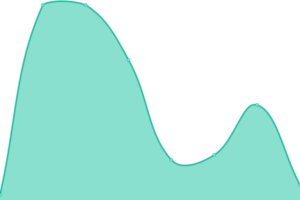

# [📈 Live Status](https://status.place-atlas.stefanocoding.me): <!--live status--> **🟩 All systems operational**

This repository contains the open-source uptime monitor and status page for [Place Atlas](https://place-atlas.stefanocoding.me/), powered by [Upptime](https://github.com/upptime/upptime).

With [Upptime](https://upptime.js.org), you can get your own unlimited and free uptime monitor and status page, powered entirely by a GitHub repository. We use [Issues](https://github.com/placeAtlas/status/issues) as incident reports, [Actions](https://github.com/placeAtlas/status/actions) as uptime monitors, and [Pages](https://status.place-atlas.stefanocoding.me) for the status page.

<!--start: status pages-->
<!-- This summary is generated by Upptime (https://github.com/upptime/upptime) -->
<!-- Do not edit this manually, your changes will be overwritten -->
<!-- prettier-ignore -->
| URL | Status | History | Response Time | Uptime |
| --- | ------ | ------- | ------------- | ------ |
|  [Place Atlas Initiative](https://place-atlas.stefanocoding.me/) | 🟩 Up | [place-atlas-initiative.yml](https://github.com/placeAtlas/status/commits/HEAD/history/place-atlas-initiative.yml) | 

 258ms
     
 | 

<a href="https://status.place-atlas.stefanocoding.me/history/place-atlas-initiative">99.87%</a>
    

|  [2017 Atlas](https://2017.place-atlas.stefanocoding.me/) | 🟩 Up | [2017-atlas.yml](https://github.com/placeAtlas/status/commits/HEAD/history/2017-atlas.yml) | 

 264ms
     
 | 

<a href="https://status.place-atlas.stefanocoding.me/history/2017-atlas">99.87%</a>
    

|  [2022 Atlas](https://2017.place-atlas.stefanocoding.me/) | 🟩 Up | [2022-atlas.yml](https://github.com/placeAtlas/status/commits/HEAD/history/2022-atlas.yml) | 

 15ms
     
 | 

<a href="https://status.place-atlas.stefanocoding.me/history/2022-atlas">99.87%</a>
    

|  [(2022) Place Catalog](https://place-catalog.stefanocoding.me/) | 🟩 Up | [2022-place-catalog.yml](https://github.com/placeAtlas/status/commits/HEAD/history/2022-place-catalog.yml) | 

 309ms
     
 | 

<a href="https://status.place-atlas.stefanocoding.me/history/2022-place-catalog">99.88%</a>
    

|  [2023 Atlas](https://2017.place-atlas.stefanocoding.me/) | 🟩 Up | [2023-atlas.yml](https://github.com/placeAtlas/status/commits/HEAD/history/2023-atlas.yml) | 

 27ms
     
 | 

<a href="https://status.place-atlas.stefanocoding.me/history/2023-atlas">100.00%</a>
    

|  [Place Wiki](https://place-wiki.stefanocoding.me/) | 🟩 Up | [place-wiki.yml](https://github.com/placeAtlas/status/commits/HEAD/history/place-wiki.yml) | 

 714ms
     
 | 

<a href="https://status.place-atlas.stefanocoding.me/history/place-wiki">98.63%</a>
    

<!--end: status pages-->

[**Visit our status website →**](https://status.place-atlas.stefanocoding.me)

## 📄 License

- Powered by: [Upptime](https://github.com/upptime/upptime)
- Code: [MIT](./LICENSE) © [Anand Chowdhary](https://anandchowdhary.com), supported by [Pabio](https://pabio.com)
- Data in the `./history` directory: [Open Database License](https://opendatacommons.org/licenses/odbl/1-0/)
